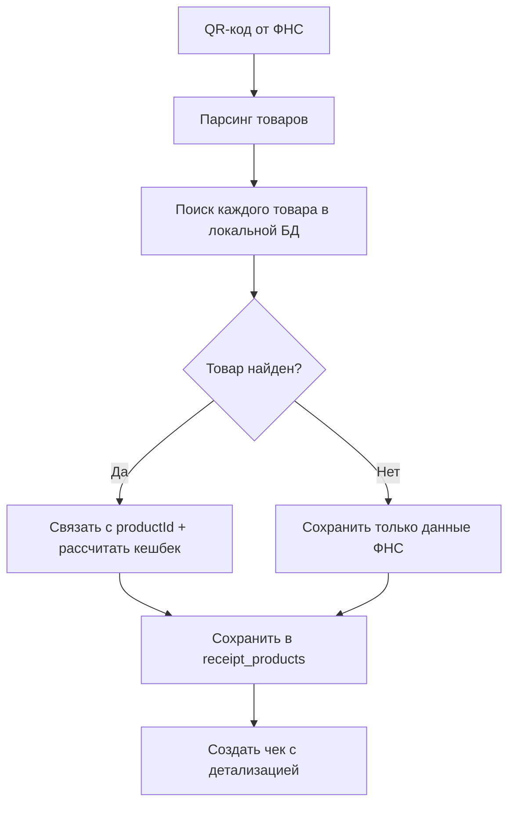

# Исправления и улучшения системы

## ✅ Устранены проблемы

### 1. Ошибка запуска приложения
**Проблема**: `AuthGuard` не был доступен в `ReceiptsModule`
**Решение**: Добавлен импорт `AuthModule` в `src/receipts/receipts.module.ts`

### 2. Ошибка создания чеков через API
**Проблема**: Поля ФНС не существовали в базе данных
**Решение**: 
- Обновлена схема Prisma в `prisma/schema.prisma`
- Применена миграция с `npx prisma db push --force-reset`
- Поля ФНС используются только в `FnsService`, не в обычном создании чеков

### 3. Валидация подсетей для предложений
**Проблема**: Система позволяла создавать предложения для подсети `z-pharm` с товарами из подсети `x-pharm`
**Решение**: Добавлена валидация в:
- `src/offers/create-offer.service.ts` - при создании предложений
- `src/offers/update-offer.service.ts` - при обновлении предложений

## 🛠️ Новые функции

### Валидация подсетей в предложениях

#### При создании предложения:
```typescript
// Проверяет, что все товары принадлежат к той же подсети, что и предложение
await this.validateProductsForPromotion(productIds, offerData.promotionId);
```

#### При обновлении предложения:
```typescript
// Проверяет принадлежность товаров при изменении списка товаров
if (productIds) {
  const offer = await this.prisma.offer.findUnique({ where: { id }, select: { promotionId: true } });
  await this.validateProductsForPromotion(productIds, offer.promotionId);
}
```

### Улучшенная логика ФНС

#### Поиск товаров в локальной БД:
```typescript
// 1. Точное совпадение названия
// 2. Частичное совпадение
// 3. Поиск по ключевым словам
const matchedProduct = await this.findProductInDatabase(fnsItem, promotionId);
```

#### Сохранение данных ФНС:
```sql
-- Новые поля в receipt_products
fnsProductName     String?   -- название из ФНС
fnsProductPrice    Int?      -- цена за единицу из ФНС  
fnsProductQuantity Decimal?  -- количество из ФНС
fnsProductSum      Int?      -- общая стоимость из ФНС
```

## 🔍 Алгоритм обработки чека из ФНС



## 🛡️ Безопасность и валидация

### Валидация предложений:
- ✅ Товары должны принадлежать к той же подсети, что и предложение
- ✅ Детальные сообщения об ошибках с указанием некорректных товаров
- ✅ Проверка существования товаров в указанной подсети

### Пример ошибки валидации:
```json
{
  "error": "Товары из другой подсети не могут быть добавлены в предложение для подсети z-pharm. Некорректные товары: \"Терафлю в пак. 6 шт.\" (ID: 1, подсеть: x-pharm, бренд: Нурофен)"
}
```

## 📋 Тестирование

### Сценарии для проверки:

1. **Создание предложения с товарами из другой подсети**
   ```bash
   POST /offers
   {
     "promotionId": "z-pharm",
     "productIds": [1, 2], // товары из x-pharm
     ...
   }
   # Ожидаемый результат: ошибка валидации
   ```

2. **Создание чека через API**
   ```bash
   POST /receipts
   {
     "promotionId": "x-pharm",
     "products": [{"productId": 1, "cashback": 100}]
   }
   # Ожидаемый результат: успешное создание
   ```

3. **Сканирование QR-кода**
   ```bash
   POST /fns/scan-qr
   {
     "fn": "1234567890",
     "fd": "123456",
     "fp": "1234567890"
   }
   # Результат: автоматический поиск товаров и создание чека
   ```

## ✅ Статус

Все проблемы устранены:
- ✅ Приложение запускается без ошибок
- ✅ API создания чеков работает корректно
- ✅ Валидация подсетей работает для предложений и чеков
- ✅ ФНС интеграция сопоставляет товары с локальной БД
- ✅ Данные ФНС сохраняются для аудита

Система готова к использованию! 🚀
